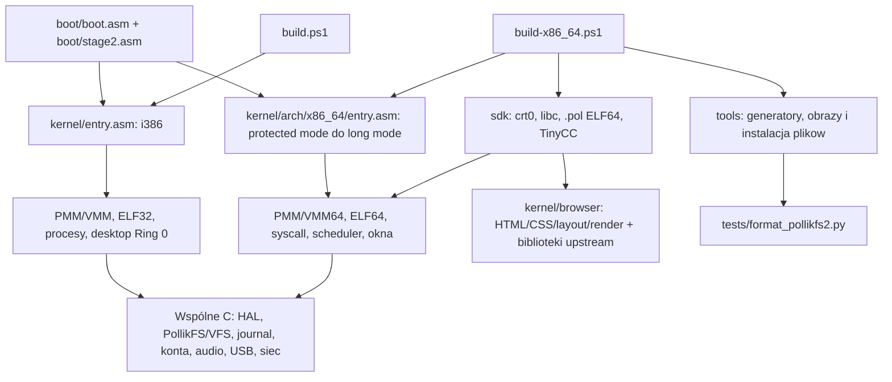

# Plan przejścia PollikOS na wyłącznie x86_64

Stan wejściowy: [X64_BASELINE.md](X64_BASELINE.md), 10.10.2026.
Ten etap przygotowuje dokumentację i zasady. Nie usuwa targetu i386,
nie zmienia ABI i nie przenosi danych użytkownika.

## Mapa zależności

### Zachować przy usuwaniu osobnego i386

- **Rozruch:** `boot/boot.asm`, `boot/stage2.asm`, `kernel/arch/x86_64/entry.asm`,
  `interrupts.asm`, `user_payload.asm`, linker x86_64. Obraz BIOS startuje pod
  1 MiB; przejściowy kod 16/32-bit jest wymagany również przez ELF64 kernel.
- **Wspólne jednostki kernela:** `kernel/{hal,storage,vfs,pollikfs,fs_journal,
  fs_journal_platform,account,account_platform,security,audio,factory_reset}.c`
  i ich nagłówki. Adaptery `POLLIK_X64` wybierają PMM64, deskryptory i ATA64;
  te pliki nie są wyłącznie kodem i386. `factory_reset.c` jest częścią zastanego
  working tree i jest już linkowany przez aktualny build.
- **USB:** `kernel/usb_input.c`, `kernel/usb_platform.c`, `kernel/usb_input.h`,
  `third_party/libpayload-usb/`, `tools/build_usb.ps1`, `common/hid_pointer.h`.
  Biblioteka USB jest kompilowana dla x86_64 i linkowana do jego kernela.
- **Sieć:** `kernel/net/{arp,dhcp,dns,icmp,ipv4,net_manager,net_util,rtl8139,
  tcp,udp,wifi_if,tls}.c`, nagłówki oraz BearSSL. Platformę zapewniają
  `kernel/arch/x86_64/net_platform.*` i `network.*`. HTTP i dekodowanie chunks
  należą do `sdk/lib/http.c`, TCP/TLS pozostają w kernelu.
- **Aplikacje i grafika:** całe używane SDK, `sdk/lib/font_data.c`,
  `common/calc.*`, `common/blur.h`, `common/ps2_pointer.h`, `common/app_search.h`,
  wspólne UI używane przez SDK oraz wymagane fonty, kursory, ikony i media.
  Browser ELF64 kompiluje `kernel/browser/{html_parser,css_engine,layout,render}.c`;
  nie usuwać całego `kernel/browser/` wraz z klientem Ring 0.
- **Biblioteki:** QuickJS/OpenLibm, libdom/libcss/libhubbub/libparserutils/
  libwapcaplet, BearSSL, Monocypher, TinyCC, stb, minimp3, h264bsd i faad2.
  Elk jest nadal wariantem `-LegacyBrowserJS`; decyzja o jego wycofaniu jest
  osobna od usuwania architektury.
- **ABI:** `include/pollikos_abi.h`, `kernel/arch/x86_64/{user_abi.h,user.h,
  stat_abi.h,dir_abi.h}` i publiczne nagłówki SDK. Zachować numery, rozmiary,
  offsety i wersje; generowane C/NASM muszą korzystać z jednego źródła.
- **Narzędzia i testy:** `tools/build_x64_{data,system}.py`, `tools/sync_system_files.py`,
  `tools/make_full_image.py`, `tools/create_vm_profile.py`, generatory bibliotek,
  assetów oraz `sdk/tools/`. Zachować `tests/format_pollikfs2.py`: importują go
  generatory x86_64 i testy natywne. Zachować helpery QEMU/TTY/fixture importowane
  przez testy x86_64; nie usuwać zbiorczo `tests/`.

### Kandydaci do osobnego usunięcia lub przeniesienia

`kernel/{entry.asm,interrupts.asm,linker.ld,pmm.c,vmm.c,mem.c,process.c,
syscall.c,elf.c}` implementują osobny runtime i386. `apps/hello`,
`apps/fault_*`, `apps/user.ld` i `include/pollikos.h` są legacy ELF32 SDK.
`apps/x86_64/` zawiera wymagane ELF64 fixtures i pozostaje.

`kernel/desktop*`, `compositor.c`, `wm.c`, `graphics.c`, `gui/`, `auth.c`
oraz klient przeglądarki Ring 0 wymagają przeglądu parytetu funkcji.
Nagłówków i wspólnych zasobów nie wolno usuwać tylko na podstawie katalogu.
`kernel/ahci.c` i `installer.c` nie są linkowane do aktualnego kernela x86_64;
ich funkcjonalność wymaga portu albo jawnej decyzji o zakresie produktu.

## Etapy i bramki akceptacji

1. **Odtwarzalny build i testy.** Najpierw zsynchronizować kontrakt manifestu
   `/bin` w SELFTEST (obecnie 55 oczekiwanych vs 56 wygenerowanych wpisów).
   Naprawić wskazane w baseline problemy
   czystego checkoutu i CI, bez osłabiania ostrzeżeń ani testów. Odseparować
   kompilację od synchronizacji istniejących dysków. Bramka: build normalny,
   SELFTEST i testy x86_64 kończą się z udokumentowanym wynikiem; testy nie
   otwierają obrazów użytkownika do zapisu.
2. **Parytet i granice wspólnego kodu.** Sprawdzić launcher, Notes/Files,
   terminal, login/lock/logout/admin, media/audio, wejście i przeglądarkę
   na x86_64. AHCI i instalator rozstrzygnąć przed kasowaniem ich jedynej
   implementacji. Porównywać rzeczywiste funkcje z `kernel/gui/` oraz testami,
   bez obietnicy pełnego parytetu na podstawie nazw aplikacji.
3. **Usunięcie osobnego targetu i386 — kolejny zatwierdzony etap.** Zmienić
   `Start-PollikOS.cmd`, `run.ps1`, build entrypoint, macierz CI, `.clangd`
   i `tools/gen_compile_commands.py` na x86_64. Usunąć wyłącznie wykazane
   jednostki i fixtures ELF32; zachować BIOS i wspólne biblioteki. Nie
   konwertować ani nie formatować istniejących obrazów danych. Bramka:
   brak osobnego targetu/loadera ELF32, build x86_64 działa z czystego checkoutu,
   manifest zależności nie wskazuje usuniętych plików.
4. **Regresja po usunięciu.** Normalny/SELFTEST/Production build w izolacji;
   pełne `x86_64_boot.py` (w tym RAM >4 GiB), storage, crash recovery,
   bezpieczeństwo/sesje, konsola/TinyCC, Notes/Files, sieć/Browser, okna,
   urządzenia, USB i media. Raportować częściowe wykonanie oraz NOT RUN.
   Aktualizować README/ARCHITECTURE/ROADMAP i kontrakty do zweryfikowanego stanu.

SMP, UEFI, NVMe, GPU, dynamiczny linker, wiele kont i pełna zgodność POSIX/Web
nie są warunkami technicznymi usunięcia i386; pozostają oddzielnymi zadaniami.
Nie poszerzać tego etapu o ich implementację.
